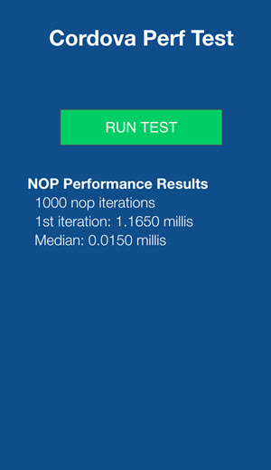

#Cordova NOP Performance Test
This app runs the com.ezartech.nop plugin to test the [Apache Cordova](https://cordova.apache.org/) 
JS-native bridge.  
  

##Getting Started
1. Install the Cordova NOP plugin from Github using the Cordova SDK CLI

    cordova plugin add https://github.com/ezartech/com.ezartech.nop

2. Install the platforms you plan to test on.  
*At this time only Android and iOS are supported.*  

    cordova platform add android
    cordova platform add ios

3. Build the project the install platforms  

    cordova build

4. Install on your device and run  
  
  
##License
See [modified MIT license](LICENSE).  
  
  
Copyright (c) 2015-2016, ezAR Technologies